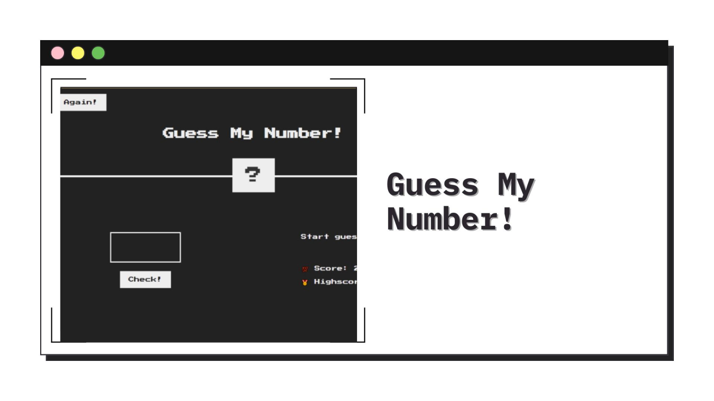

<h1 align="center">Guess My Number
</h1>



<h2 align="center"> 
	🚧 Guess My Number 🟢 Completed 🚀 🚧
  
</h2>

&nbsp;

<!--
## Table of contents

- [Project description](#description) - [What I learned](#What-I-learned) -->

<h2 id="#description">Project description 📚</h2>

Guess My Number - A game developed with HTML, CSS and Vanilla JS.

This game was developed on Jonas Schmedtmann's JavaScript course to practice the basics of DOM Manipulation, it's a guessing number game.

This fun game aims to guess the number that the user has typed in the box above the check button! and after clicking the button, the game algorithm will check to see if the number is the same as the one hidden in the '?', the game allows only 20 attempts, it is also possible to save the highest score in Highscore, and also reset the game on the button Again!

&nbsp;

## What I learned

In this project I learned the basics of DOM, how to select elements, events, DRY(Don't repeat yourself), functions and handling classes with classlist.

```js
document.querySelector('.check').addEventListener('click', function () {
  ...
});
document.querySelector('.again').addEventListener('click', function () {
  ...
});
```

&nbsp;

## Links

- [Preview Site](https://viniciusshenri96.github.io/guess-my-number/)

&nbsp;

## My process

### Built with

- [HTML](https://developer.mozilla.org/en-US/docs/Web/HTML)
- [CSS](https://developer.mozilla.org/en-US/docs/Web/CSS)
- [Vanilla Js](http://vanilla-js.com)

&nbsp;

## 👨‍💻 Author

- [Frontend Mentor](https://www.frontendmentor.io/profile/viniciusshenri96)
- [Linkedin](https://www.linkedin.com/in/vinícius-henrique-7a2533229/)
